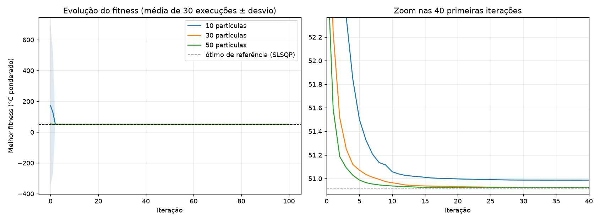
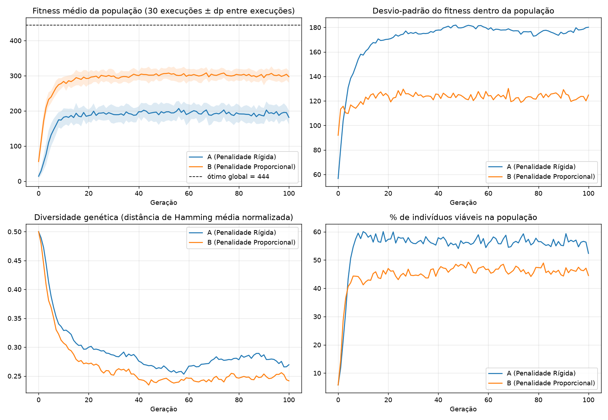
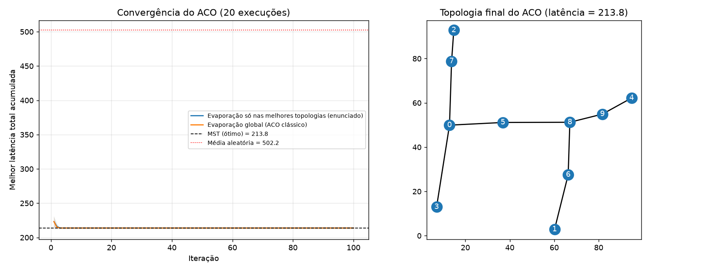

# Resultados — Aula 08 (Fechamento da AC-2)
Otimização de Sistemas Computacionais e Resiliência de Redes

## Premissas e pontos de atenção do enunciado
- **Lab 01:** se a temperatura de uma AZ fosse apenas o coeficiente C, o problema seria trivial (w4 = 1, 30 °C) e a penalidade de 75 °C jamais dispararia (maior C = 65). Por isso foi adotado o modelo `T_i = C_i * (1 + 1,5 * w_i)` (quanto mais tráfego, mais o rack esquenta). O modelo literal também foi executado para documentar o resultado trivial.
- **Lab 02 e Lab 03:** o enunciado não fornece os dados (microsserviços e matriz D). Foram gerados de forma reprodutível (seeds fixas) e estão listados abaixo.
- **Lab 03:** conectar N nós em árvore geradora de custo mínimo tem solução exata (MST). O MST foi usado como ótimo de referência para validar o ACO. A "evaporação só nas melhores topologias" foi implementada como pedido e comparada com a evaporação global clássica. Como não há pesos de "pares críticos", o custo é a soma das latências das arestas da árvore.
- Bibliotecas: apenas numpy/matplotlib; scipy somente para validar o ótimo do Lab 01 (não faz parte dos algoritmos).

---

## Lab 01 — PSO para balanceamento de carga

Ótimo de referência (SLSQP, só para validação): fitness = 50.9188, W = [0.183, 0.2863, 0.0406, 0.3895, 0.1004, 0.0003]

| População | w1 | w2 | w3 | w4 | w5 | w6 | sum(wi) | Fitness (melhor) | Média±dp (30 execuções) | Tmax AZ | % avaliações com violação |
|---|---|---|---|---|---|---|---|---|---|---|---|
| 10 | 0.1830 | 0.2863 | 0.0406 | 0.3895 | 0.1004 | 0.0003 | 1.0000000000 | 50.9188 | 50.9867 ± 0.1666 | 65.03 | 1.9% |
| 30 | 0.1830 | 0.2863 | 0.0406 | 0.3895 | 0.1004 | 0.0003 | 1.0000000000 | 50.9188 | 50.9188 ± 0.0000 | 65.03 | 1.5% |
| 50 | 0.1830 | 0.2863 | 0.0406 | 0.3895 | 0.1004 | 0.0003 | 1.0000000000 | 50.9188 | 50.9243 ± 0.0293 | 65.03 | 1.4% |

Modelo literal (temperatura = coeficiente C, sem efeito de carga), 30 partículas:
W = [0.0, 0.0, 0.0, 1.0, 0.0, 0.0], sum = 1.0000000000, fitness = 30.0000, violações = 0

Fitness médio por iteração (marcos):

| Iteração | 10 | 30 | 50 |
|---|---|---|---|
| 0 | 172.3633 | 53.8908 | 52.9828 |
| 5 | 51.5021 | 51.0708 | 50.9876 |
| 10 | 51.0581 | 50.9649 | 50.9375 |
| 20 | 50.9974 | 50.9311 | 50.9247 |
| 50 | 50.9867 | 50.9229 | 50.9243 |
| 100 | 50.9867 | 50.9188 | 50.9243 |



**Análise.** As três populações convergem para a mesma distribuição, que coincide com o ótimo de referência (50,9188 °C ponderados). A população de 10 partículas converge mais devagar e às vezes estaciona em ótimos ligeiramente piores (média 50,987 ± 0,167), porque explora menos o espaço. As de 30 e 50 chegam praticamente ao ótimo em todas as execuções; o ganho de 30 para 50 é marginal frente ao custo extra de avaliações, então 30 é o melhor custo-benefício. A normalização garante sum(wi) = 1,0 em todas as iterações. A penalidade externa atuou apenas nas primeiras iterações (1,4% a 1,9% das avaliações violaram 75 °C), empurrando o enxame para longe de w6 alto; a melhor solução tem Tmax ≈ 65 °C, abaixo do limite.

---

## Lab 02 — AG binário (penalidade rígida x proporcional)

Dados dos 15 microsserviços (gerados com seed=7, pois o enunciado não os fornece):

| Serviço | Valor | RAM (GB) | CPU (cores) |
|---|---|---|---|
| S1 | 95 | 5.0 | 0.5 |
| S2 | 66 | 3.5 | 0.5 |
| S3 | 72 | 2.5 | 1.5 |
| S4 | 91 | 2.5 | 1.5 |
| S5 | 62 | 2.5 | 2.5 |
| S6 | 80 | 3.0 | 2.0 |
| S7 | 85 | 3.5 | 1.5 |
| S8 | 30 | 4.0 | 1.5 |
| S9 | 15 | 6.0 | 1.0 |
| S10 | 37 | 5.0 | 0.5 |
| S11 | 35 | 4.0 | 1.0 |
| S12 | 89 | 6.0 | 2.0 |
| S13 | 93 | 2.0 | 1.0 |
| S14 | 10 | 2.0 | 1.0 |
| S15 | 55 | 4.0 | 0.5 |

Ótimo global por força bruta (2^15 combinações): valor = 444, serviços = ['S1', 'S4', 'S6', 'S7', 'S13'], RAM = 16.0, CPU = 6.5

Parâmetros: população 60, 100 gerações, torneio k=3, cruzamento 1 ponto pc=0.9, mutação pm=1/15, elitismo 1, alpha(B)=1.5, 30 execuções independentes.

| Estratégia | Melhor valor viável (melhor execução) | Média±dp dos melhores (30 exec.) | Execuções que acharam o ótimo | Execuções cujo melhor da população final era inviável | Melhor combinação |
|---|---|---|---|---|---|
| A (Penalidade Rígida) | 444 | 444.0 ± 0.0 | 30/30 | 0/30 | ['S1', 'S4', 'S6', 'S7', 'S13'] (RAM 16.0, CPU 6.5) |
| B (Penalidade Proporcional) | 444 | 444.0 ± 0.0 | 30/30 | 0/30 | ['S1', 'S4', 'S6', 'S7', 'S13'] (RAM 16.0, CPU 6.5) |

| Geração | A: média | A: dp | A: diversidade | A: % viáveis | B: média | B: dp | B: diversidade | B: % viáveis |
|---|---|---|---|---|---|---|---|---|
| 0 | 13.9 | 56.6 | 0.500 | 6% | 55.8 | 91.9 | 0.500 | 6% |
| 10 | 181.9 | 157.4 | 0.329 | 60% | 283.7 | 117.1 | 0.307 | 41% |
| 25 | 193.7 | 174.0 | 0.293 | 58% | 301.0 | 124.4 | 0.259 | 45% |
| 50 | 193.9 | 180.0 | 0.268 | 56% | 306.0 | 123.2 | 0.245 | 48% |
| 75 | 191.5 | 176.5 | 0.278 | 56% | 301.3 | 122.7 | 0.248 | 45% |
| 100 | 181.3 | 180.1 | 0.270 | 52% | 297.2 | 124.8 | 0.242 | 45% |

Diversidade média ao longo das gerações, A (Penalidade Rígida): 0.294
Diversidade média ao longo das gerações, B (Penalidade Proporcional): 0.267



**Análise.**
- **Melhor combinação final:** empate. As duas estratégias encontraram o ótimo global (valor 444, confirmado por força bruta) em 30/30 execuções.
- **Diversidade genética:** a Estratégia A (rígida) preservou mais diversidade (média 0,294 contra 0,267 da B). Com fitness = 0, todos os inviáveis são equivalentes e a seleção não os distingue, o que mantém a população mais espalhada; na B, o gradiente de penalidade pressiona mais a convergência para a região de fronteira.
- **Fitness médio:** a B tem média maior porque inviáveis próximos da fronteira mantêm fitness parcial, e a A tem média menor porque zera esses indivíduos. As médias não são diretamente comparáveis, pois as funções de fitness são diferentes; por isso também se reporta o % de indivíduos viáveis.
- **Ressalva:** a B com alpha = 1,5 não deixou nenhum inviável como melhor da população final. Com alpha pequeno isso poderia ocorrer, então o alpha precisa ser calibrado.

---

## Lab 03 — ACO para topologia de rede

Matriz de latências D (10x10, gerada a partir de coordenadas com seed=11, pois o enunciado não a fornece):

```
[[   0.0   66.7   42.9   37.4   82.9   24.1   57.9   28.9   54.2   69.0]
 [  66.7    0.0  100.7   54.1   68.7   53.6   25.4   89.0   48.9   56.3]
 [  42.9  100.7    0.0   80.2   85.7   47.2   83.2   14.1   66.8   76.9]
 [  37.4   54.1   80.2    0.0  100.6   48.5   61.0   66.2   71.2   85.6]
 [  82.9   68.7   85.7  100.6    0.0   59.0   44.9   82.7   29.9   15.0]
 [  24.1   53.6   47.2   48.5   59.0    0.0   37.7   36.0   30.1   44.9]
 [  57.9   25.4   83.2   61.0   44.9   37.7    0.0   73.4   23.7   31.4]
 [  28.9   89.0   14.1   66.2   82.7   36.0   73.4    0.0   60.0   72.0]
 [  54.2   48.9   66.8   71.2   29.9   30.1   23.7   60.0    0.0   15.1]
 [  69.0   56.3   76.9   85.6   15.0   44.9   31.4   72.0   15.1    0.0]]
```

Parâmetros: rho=0.2, alpha=1.0, beta=3.0, 30 formigas, 100 iterações, deposita as 3 melhores, Q=100.0, 20 execuções.

Matriz de Adjacência final (ACO, evaporação só nas melhores topologias):

```
[[0 0 0 1 0 1 0 1 0 0]
 [0 0 0 0 0 0 1 0 0 0]
 [0 0 0 0 0 0 0 1 0 0]
 [1 0 0 0 0 0 0 0 0 0]
 [0 0 0 0 0 0 0 0 0 1]
 [1 0 0 0 0 0 0 0 1 0]
 [0 1 0 0 0 0 0 0 1 0]
 [1 0 1 0 0 0 0 0 0 0]
 [0 0 0 0 0 1 1 0 0 1]
 [0 0 0 0 1 0 0 0 1 0]]
```

Arestas: [(0, 3), (0, 5), (0, 7), (1, 6), (2, 7), (4, 9), (5, 8), (6, 8), (8, 9)], nº de arestas = 9, árvore válida = True

| Método | Latência total |
|---|---|
| MST (Prim, ótimo exato) | 213.8 |
| ACO evaporação só nas melhores (enunciado): melhor / média±dp | 213.8 / 213.8 ± 0.0 (ótimo em 20/20 execuções) |
| ACO evaporação global (clássico): melhor / média±dp | 213.8 / 213.8 ± 0.0 (ótimo em 20/20 execuções) |
| Topologia aleatória única (seed 2024) | 570.5 |
| Topologias aleatórias (2000): média±dp / melhor | 502.2 ± 61.0 / 300.9 |

| Comparação | Ganho de redução de latência |
|---|---|
| ACO (melhor) vs topologia aleatória única | 62.52% |
| ACO (melhor) vs média de 2000 aleatórias | 57.43% |
| ACO (média das 20 exec.) vs média de 2000 aleatórias | 57.43% |
| ACO global (média) vs média aleatórias | 57.43% |
| Gap do ACO (melhor) para o MST | 0.00% |



**Análise.** O ACO construiu árvores sempre válidas (união-busca impede ciclos e garante conectividade, com exatamente 9 arestas) e alcançou a latência do MST (213,8) em 20/20 execuções, com redução de cerca de 57% sobre a média de topologias aleatórias e 62,5% sobre a topologia aleatória sorteada. Os dois modos de evaporação chegaram ao mesmo resultado neste problema pequeno (45 arestas); a diferença só apareceria em instâncias maiores. Como o MST resolve o problema exatamente em tempo polinomial, o ACO aqui tem valor didático.

---

## Como reproduzir
```
python lab01_aula08.py
python lab02_aula08.py
python lab03_aula08.py
```
