# Resultados — Aula 09 (Sprint 1 / AC-3): Modelagem de variáveis e conjuntos fuzzy

Arquivos: `lab01_aula09.py`, `lab02_aula09.py`, `lab03_aula09.py` (cópia em `lab03_aula09.txt`). Todos foram executados (Python + scikit-fuzzy 0.5.0) e as imagens estão na pasta `img/`.

---

## O que a lógica fuzzy realiza

Na lógica clássica, uma temperatura é "quente" ou "não quente" (pertinência 0 ou 1). A lógica fuzzy permite **graus de pertinência entre 0 e 1**: 30 °C pode ser 50% "morno" e 50% "quente" ao mesmo tempo. O sistema de inferência (tipo Mamdani, usado pelo scikit-fuzzy) faz quatro passos:

1. **Fuzzificação** – converte o número medido (ex.: 20 °C) em graus de pertinência para cada termo linguístico (frio = 0,5; morno = 0,5; quente = 0).
2. **Avaliação das regras** – cada regra SE…ENTÃO dispara com intensidade igual à pertinência do antecedente. **E** = mínimo, **OU** = máximo, **NÃO** = 1 − μ.
3. **Agregação** – o conjunto de saída de cada regra é "cortado" (clipping) na intensidade da regra e todos são unidos (máximo), formando uma única área.
4. **Defuzzificação** – a área agregada é convertida em um número; o padrão é o **centroide** (centro de massa da área).

Resultado prático: a saída muda **de forma gradual e suave** com a entrada, imitando o raciocínio "mais ou menos" humano, em vez de saltos bruscos como em um `if temp > 30`.

---

## Lab 01 — Ventilador fuzzy

**Modelagem**

| Variável | Universo | Termos (forma) |
|---|---|---|
| temperatura | 0–40 °C | frio (trapézio [0,0,15,25]), morno (triângulo [15,25,35]), quente (trapézio [25,35,40,40]) |
| velocidade | 0–100 % | baixa (tri [0,0,50]), média (tri [0,50,100]), alta (tri [50,100,100]) |

Regras: frio → baixa; morno → média; quente → alta.

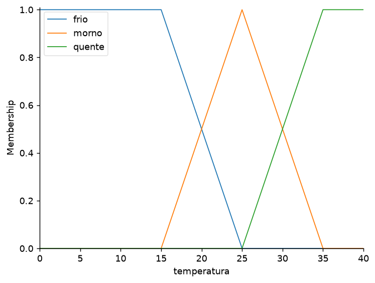
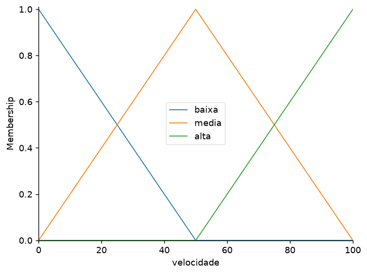

**Saída da execução**

| Temp. | μ frio | μ morno | μ quente | Velocidade |
|---|---|---|---|---|
| 10 °C | 1,00 | 0,00 | 0,00 | 17 % |
| 20 °C | 0,50 | 0,50 | 0,00 | 44 % |
| 25 °C | 0,00 | 1,00 | 0,00 | 50 % |
| 30 °C | 0,00 | 0,50 | 0,50 | 56 % |
| 38 °C | 0,00 | 0,00 | 1,00 | 83 % |

**Interpretação.** A 25 °C só a regra "morno" dispara (μ = 1) e a saída é exatamente 50 %. A 20 °C duas regras disparam com força 0,5 (baixa e média) e o centroide da área combinada fica em 44 %, entre os dois extremos, e não num salto de "baixa" para "média". A 10 °C e a 38 °C a saída não chega a 0 % nem a 100 % porque o centroide de um triângulo com ombro nunca está exatamente na extremidade.

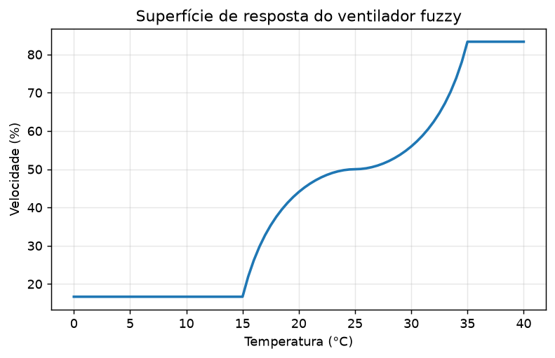
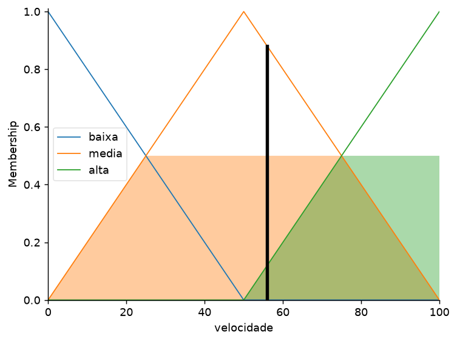

---

## Lab 02 — Gorjeta (experimentos)

Execução padrão (serviço = 7, comida = 3): **gorjeta = 12,5 %**.

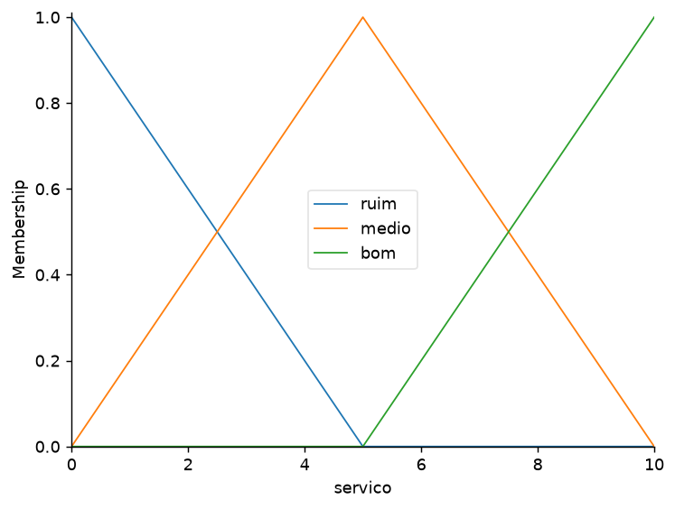

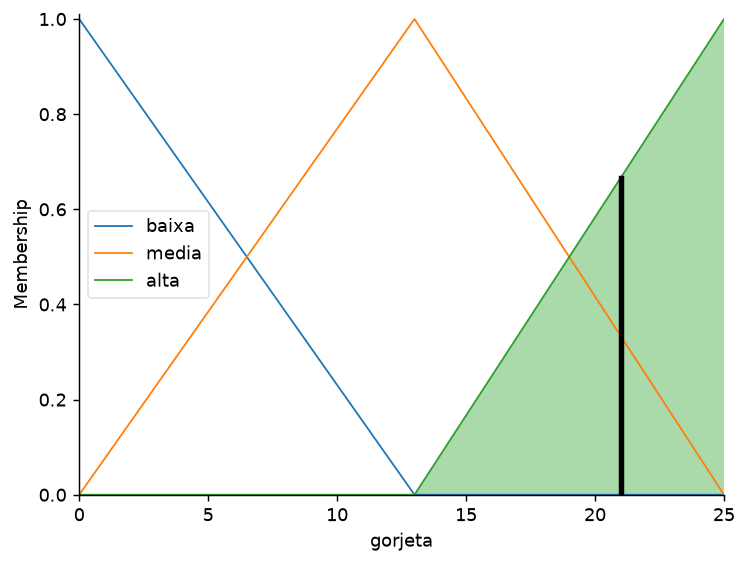

| # | Experimento | Resultado para (7, 3) | Análise |
|---|---|---|---|
| 1 | Regra 2: `servico["medio"]` → `servico["medio"] & comida["medio"]` | 12,55 % → 12,55 % | **Não mudou.** Em (7,3): μ_serviço-médio = 0,6 e μ_comida-média = 0,6; o E usa mínimo, min(0,6; 0,6) = 0,6, igual ao valor da regra original. A diferença só aparece quando as duas notas têm pertinências diferentes (a regra com E fica limitada pela menor). |
| 2 | Triângulos de serviço → trapézios / gaussianas | tri 12,55 %; trap 12,97 %; gauss 12,28 % | A variação é menor que 1 ponto percentual. As formas trapezoidal e gaussiana mudam a *curva* (platôs ou transições suaves), mas, para um único ponto, o resultado quase não muda. A gaussiana dá a curva mais suave. |
| 3 | Método de defuzzificação | centroid 12,55; bisector 12,58; mom 12,75; som 7,80; lom 17,80 | Centroide e bissetriz são parecidos (consideram a área toda). *som/mom/lom* (menor/média/maior dos máximos) olham só o topo da área, por isso 7,80 e 17,80 são bem diferentes: são mais "bruscos". |
| 4 | Novo conjunto "excelente" + regra `servico["excelente"] → alta` | 14,58 % ((7,3) e (10,3)) | Redefini os conjuntos de serviço (4 triângulos sobrepostos), por isso (7,3) mudou de 12,55 para 14,58. (7,3) e (10,3) dão o mesmo valor porque, nos dois casos, as regras disparam com as mesmas forças (alta = 1,0 e baixa = 0,4). |
| 5 | Casos-limite | (0,0) → 4,33 %; (10,10) → 21,00 %; (5,5) → 12,67 % | Comportamento coerente (ruim → baixa, ótimo → alta, médio → média), mas **não chega a 0 % nem 25 %**: efeito do centroide, que "puxa" para o meio da área agregada. |

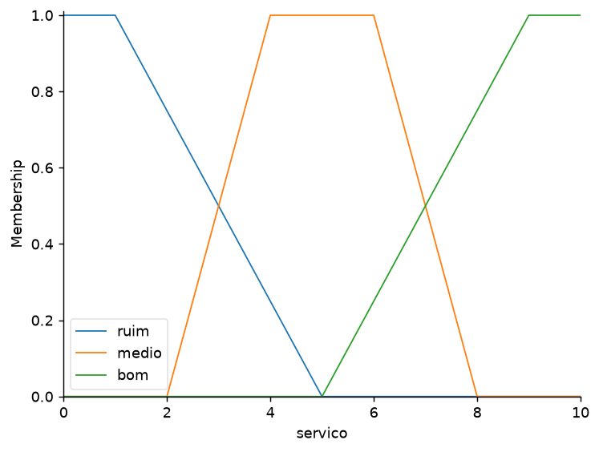
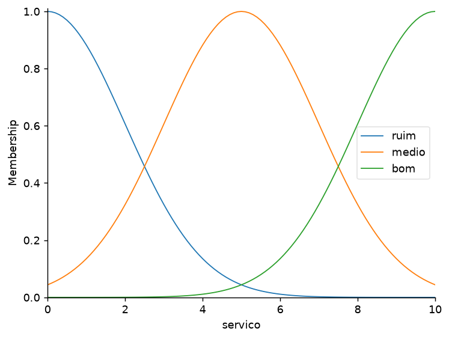
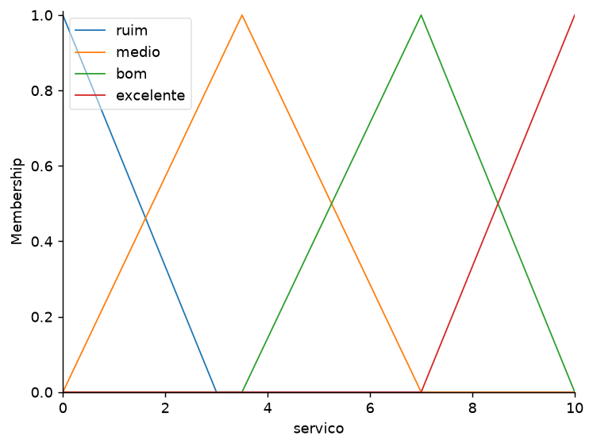

---

## Lab 03 — Agro: dose de fertilizante nitrogenado

### Etapa 1 — Definição do problema
Em lavouras, a dose de adubo nitrogenado é decidida pelo agrônomo ou produtor combinando a análise de solo e o estágio da cultura. A recomendação depende do **pH do solo** ("ácido", "ideal", "alcalino") e da **fase da cultura** ("início", "vegetativa", "reprodutiva", "maturação"), sem limites exatos entre essas categorias. As **entradas** são pH (4–9) e fase (% do ciclo); a **saída** é a dose de N (kg/ha). Fuzzy é adequado porque as fronteiras são graduais (pH 5,5 já é "meio ácido, meio ideal") e porque a decisão combina duas variáveis em ao menos 7 regras, o que um simples `if` não representaria bem.

> **Premissa didática:** em solo ácido ou alcalino a planta absorve pior o nitrogênio, então o modelo reduz a dose (evitando desperdício) até que o pH seja corrigido. Não é uma recomendação agronômica real; as doses e faixas devem ser calibradas com um especialista/laudo de solo.

### Etapa 2 — Modelagem

| Variável | Universo (unidade) | Termos e formas |
|---|---|---|
| ph | 4,0 a 9,0 (adimensional) | ácido: trapézio [4; 4; 5,0; 5,8] · ideal: triângulo [5,2; 6,0; 6,8] · alcalino: trapézio [6,2; 7,2; 9; 9] |
| fase | 0 a 100 (% do ciclo) | inicial: trap [0;0;15;35] · vegetativa: tri [20;45;70] · reprodutiva: tri [50;70;90] · maturação: trap [75;90;100;100] |
| dose | 0 a 120 (kg N/ha) | nula: trap [0;0;5;20] · baixa: tri [10;30;50] · média: tri [40;65;90] · alta: trap [75;100;120;120] |

**Base de regras** (E = mínimo, OU = máximo)

| # | Regra |
|---|---|
| R1 | SE pH é ideal **E** fase é vegetativa ENTÃO dose é alta |
| R2 | SE pH é ideal **E** fase é reprodutiva ENTÃO dose é média |
| R3 | SE pH é ideal **E** fase é inicial ENTÃO dose é baixa |
| R4 | SE (pH é ácido **OU** pH é alcalino) **E** fase é vegetativa ENTÃO dose é média |
| R5 | SE (pH é ácido **OU** pH é alcalino) **E** fase é inicial ENTÃO dose é baixa |
| R6 | SE (pH é ácido **OU** pH é alcalino) **E** fase é reprodutiva ENTÃO dose é baixa |
| R7 | SE fase é maturação ENTÃO dose é nula |

As 7 regras cobrem todas as combinações pH × fase (3 × 4).

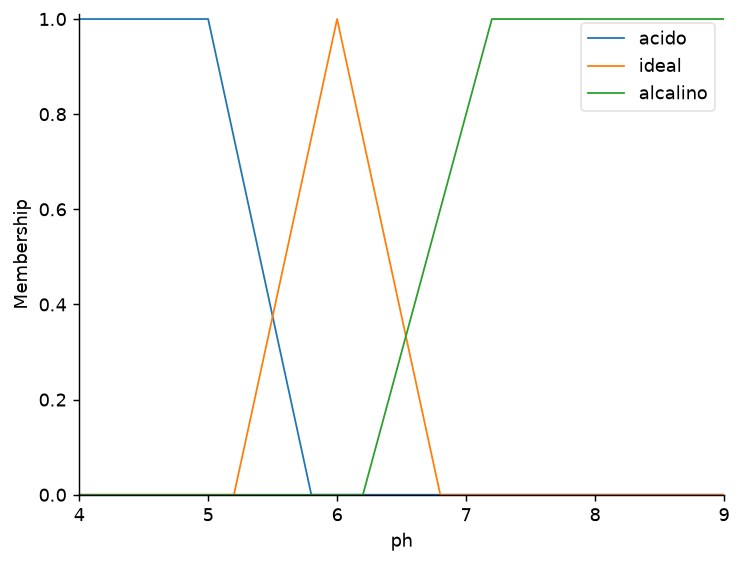
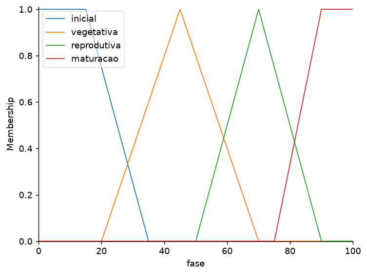
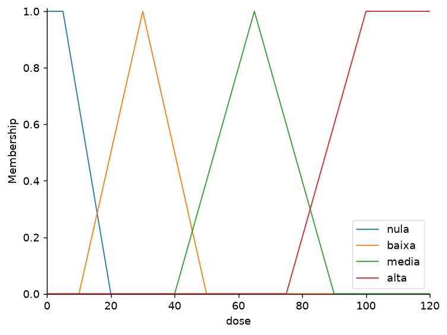

### Justificativa dos limites do universo e das formas

**Limites dos universos**
- **pH 4,0–9,0:** cobre a faixa em que ocorrem solos agrícolas reais (solos brasileiros costumam ser ácidos, em torno de 4,5–6,5; acima de 8,5 é raro). A faixa é larga o suficiente para os extremos existirem, mas sem desperdiçar resolução em valores que não ocorrem (0–14).
- **Fase 0–100 %:** normaliza o ciclo, de modo que o mesmo modelo serve para culturas de ciclos diferentes (soja, milho, etc.).
- **Dose 0–120 kg N/ha:** o teto de 120 é uma escala didática, compatível com a ordem de grandeza de adubações nitrogenadas; o piso 0 representa "não adubar".

**Formas das funções de pertinência**
- **Trapézios nos extremos** (ácido, alcalino, inicial, maturação, nula, alta): nesses termos existe uma faixa onde a classificação é *certa* (μ = 1) — qualquer pH abaixo de 5 é claramente ácido; o platô também evita que o termo "desapareça" nas bordas do universo.
- **Triângulos nos termos centrais** (ideal, vegetativa, reprodutiva, baixa, média): representam um valor *típico* único (pH 6,0 é o ótimo; a vegetativa tem pico em 45 %), com perda gradual de pertinência para os dois lados. O triângulo é simples de calibrar (3 parâmetros).
- **Sobreposição de ~30–50 %** entre termos vizinhos para que sempre haja ao menos uma regra ativa e a transição da saída seja suave.

### Etapa 3 — Implementação
Código em `lab03_aula09.py` (igual ao conteúdo de `lab03_aula09.txt`).

### Etapa 4 — Testes
As faixas esperadas foram definidas a partir do raciocínio agronômico acima.

| ID | pH | Fase (%) | Saída (kg N/ha) | Resposta esperada | Status |
|---|---|---|---|---|---|
| T1 | 6,0 | 45 | 102,9 | alta (75–120) | OK |
| T2 | 4,5 | 45 | 65,0 | média (40–80) | OK |
| T3 | 6,0 | 95 | 7,0 | nula (0–15) | OK |
| T4 | 7,8 | 10 | 30,0 | baixa (15–45) | OK |
| T5 | 6,0 | 10 | 30,0 | baixa (15–45) | OK |
| T6 | 5,5 | 60 | 67,1 | média/alta (40–85) | OK |

**Observação honesta sobre T1:** minha primeira faixa esperada era 75–100, e a saída (102,9) ficou ligeiramente acima. O erro estava na faixa, não no sistema: o termo "alta" vai de 75 a 120 kg/ha, então seu centroide cai em torno de 103. Corrigi o esperado para 75–120 (o suporte do termo "alta") e reexecutei.

**Leitura dos resultados**
- **T1 vs T2:** mesma fase (vegetativa), mas o solo ácido reduz a dose de 103 para 65 kg/ha. É o efeito das regras R1 versus R4.
- **T4 e T5:** solo alcalino e solo ideal dão o mesmo valor (30) na fase inicial, porque R3 e R5 têm a mesma saída ("baixa") — decisão de projeto: na fase inicial o pH não altera a recomendação.
- **T6 (pH 5,5, fase 60 %):** estamos em zona de transição (ácido/ideal e vegetativa/reprodutiva); várias regras disparam ao mesmo tempo e a saída (67 kg/ha) é um intermediário, o comportamento típico de fuzzy.

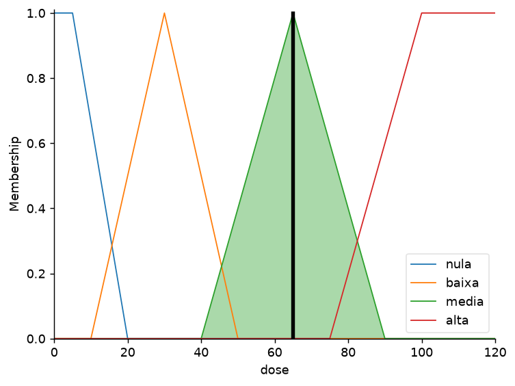
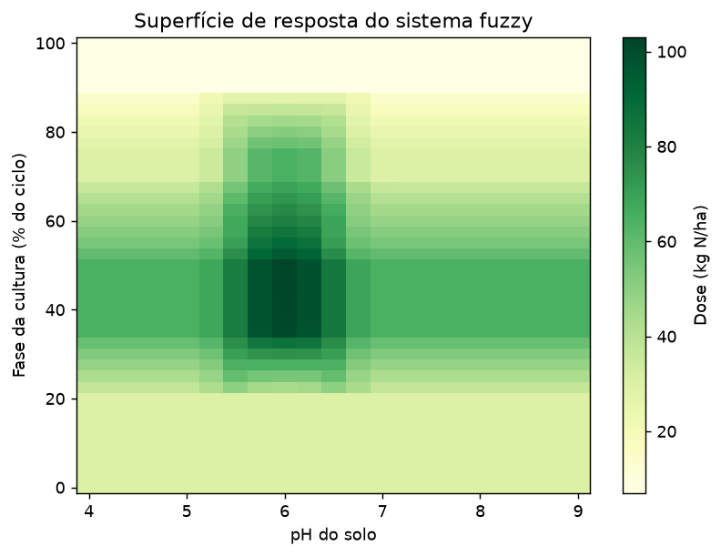

A superfície mostra a dose máxima na faixa pH ≈ 6 e fase ≈ 45 %, queda em solos fora do ideal e dose praticamente nula no fim do ciclo.

### Etapa 5 — Entrega
Código executável: `lab03_aula09.py` (`python lab03_aula09.py`).

---

## Como reproduzir
```
pip install numpy matplotlib scikit-fuzzy scipy networkx packaging
python lab01_aula09.py
python lab02_aula09.py     # Enter nas perguntas usa os valores padrão (7 e 3)
python lab03_aula09.py
```
As imagens são salvas em `img/`.
